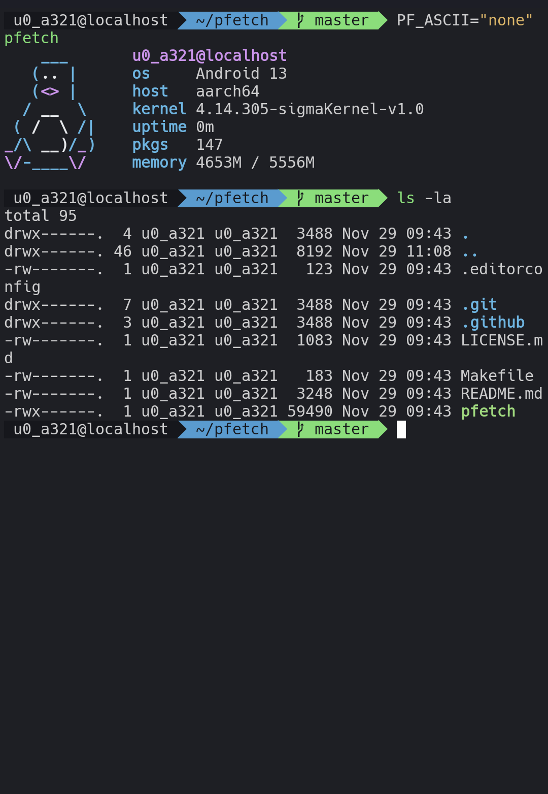

  <h1>Moonbloom for <a href="https://termux.dev/en/">Termux</a></h1>
  <a href="#">Github</a> • <a href="#">Website</a> • <a href="#">Discussions</a>

 

> Termux is an Android terminal emulator and Linux environment app that works directly with no rooting or setup required. A minimal base system is installed automatically - additional packages are available using the APT package manager.

        
        

