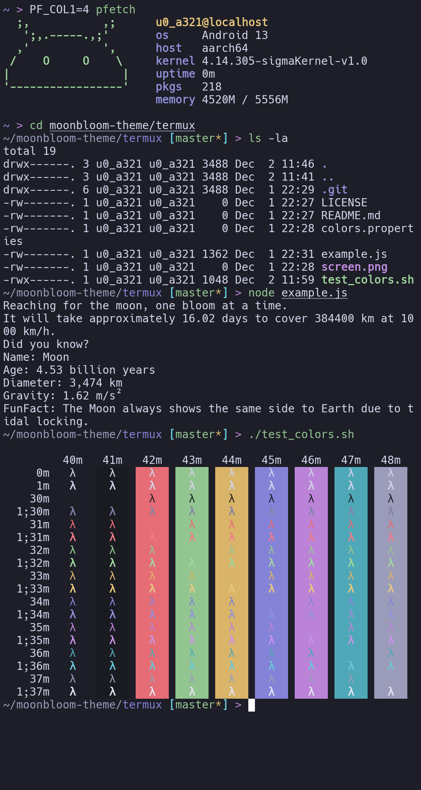

  <h1>Moonbloom for <a href="https://termux.dev/en/">Termux</a></h1>
  
Gentle on the eyes, evoking the cozy tranquility of a serene night.

  <a href="https://github.com/moonbloom-theme/moonbloom">Homepage</a> • <a href="https://moonbloom.teplostanski.dev">Website</a> • <a href="https://github.com/orgs/moonbloom-theme/discussions">Discussions</a>

 

> [Termux](https://termux.dev/en/) is an Android terminal emulator and Linux environment app that works directly with no rooting or setup required. A minimal base system is installed automatically - additional packages are available using the APT package manager.

## Install
See [INSTALL.md](./INSTALL.md)

  
  

